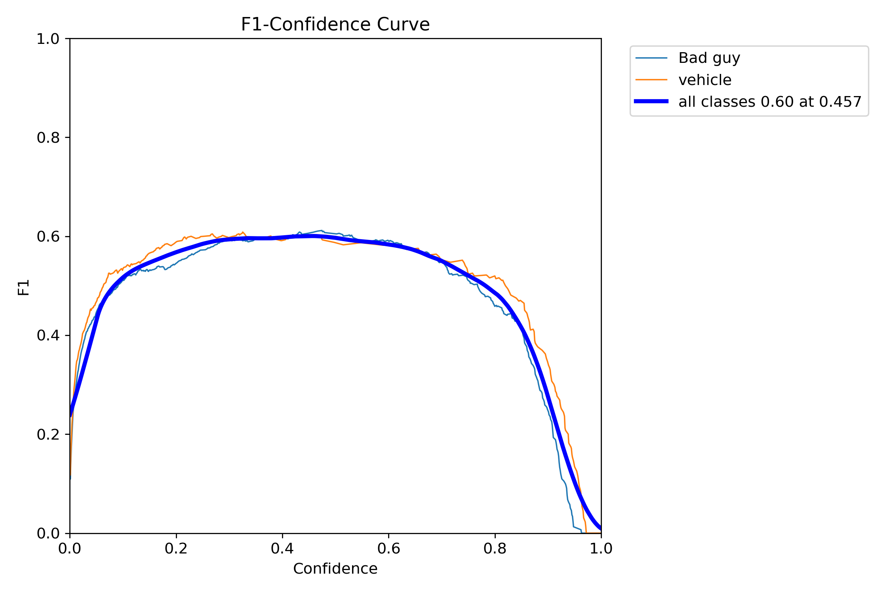
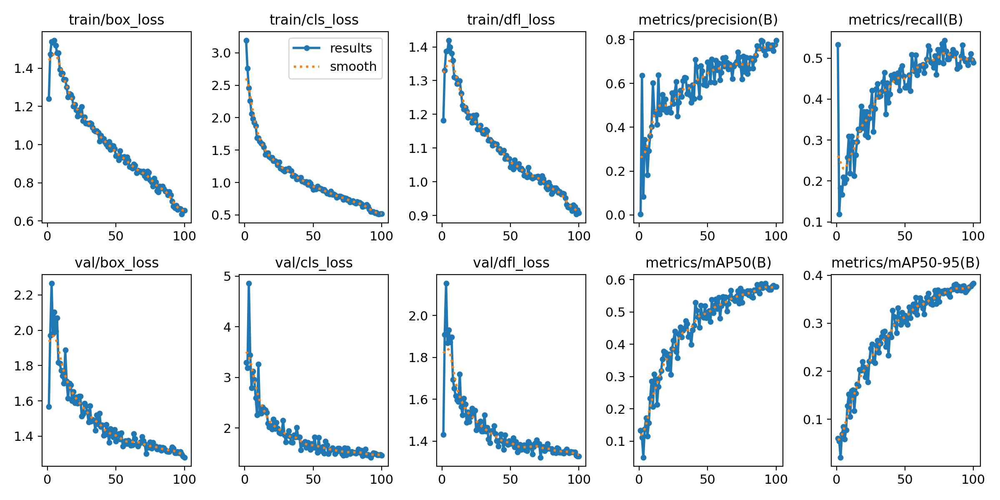

# ros2-ai-security-robot
An autonomous mobile security platform built with ROS 2 Jazzy and YOLOv8n11 on Raspberry Pi 4. Features real-time person detection, collision avoidance, and distributed node architecture.
# AI-Powered Security Robot (ROS 2 + GoPiGo3)

## Project Overview
This project implements a fully autonomous security robot using **ROS 2 Jazzy**, a **Raspberry Pi 4**, and a custom-trained **YOLOv8** artificial intelligence model.

The robot is designed to patrol a designated area and use computer vision to distinguish between authorized vehicles and unauthorized intruders ("Bad Guys"). Upon detection, the robot executes autonomous safety protocols, including halting motors and changing LED indicators. It also features a manual override mode for direct control.

## Key Features
* **Computer Vision:** Utilizes a custom YOLOv8 model trained for 100 epochs to detect people and vehicles in real-time.
* **Distributed Architecture:** Built on ROS 2 with separate nodes for vision processing, motor control, and user input.
* **Autonomous Reaction:** Automatically stops movement and triggers visual alerts (Red for intruders, Blue for vehicles) upon detection.
* **Hardware Acceleration:** Includes support for TFLite models for optimized inference on edge devices.

## Hardware Requirements
* **Computer:** Raspberry Pi 4 (4GB or 8GB RAM recommended)
* **Operating System:** Ubuntu 24.04 LTS (Noble Numbat)
* **Robot Platform:** Dexter Industries GoPiGo3
* **Camera:** USB Webcam or Raspberry Pi Camera Module
* **Power:** GoPiGo3 Battery Pack (Required for motor operation)

## Installation Guide

### 1. System Dependencies
Install the required low-level drivers for GPIO, I2C, and SPI communication.

```bash
sudo apt update
sudo apt install -y python3-pip python3-rpi-lgpio python3-smbus i2c-tools git pigpio-tools python3-pigpio
```
### 2. Robot Drivers and Configuration
Install the GoPiGo3 drivers and apply the necessary speed fix for the Raspberry Pi 4.

```bash
# Install Drivers
cd ~
git clone [https://github.com/DexterInd/GoPiGo3.git](https://github.com/DexterInd/GoPiGo3.git)
cd GoPiGo3/Software/Python
sudo pip3 install --break-system-packages -e .

# Permission Setup (Requires Reboot)
sudo usermod -aG i2c,gpio,plugdev $USER
```
### 3. ROS 2 Workspace Setup
Clone this repository into your ROS 2 source directory and build the package.

```bash
mkdir -p ~/ros2_ws/src
cd ~/ros2_ws/src
git clone [https://github.com/YOUR_USERNAME/ai-security-robot.git](https://github.com/YOUR_USERNAME/ai-security-robot.git)
cd ~/ros2_ws
colcon build --packages-select robot_brain
source install/setup.bash
```
## Usage Instructions
### Option 1: Autonomous Mode
Open two separate terminals to start the vision and driver nodes.

Terminal 1: Vision System
```bash
ros2 run robot_brain vision_node
```
Terminal 2: Motor Controller
```bash
ros2 run robot_brain driver_node
```
### Option 2: Manual Control
To manually drive the robot, run the keyboard node in a third terminal.
```bash
ros2 run robot_brain keyboard_node
```
W: Move Forward

A: Turn Left

S: Stop

D: Turn Right

Q: Quit

## Training Performance
The AI model was trained on a custom dataset for 100 epochs using a Tesla T4 GPU. Below are the performance metrics.

| Metric | Graph | Description |
| :--- | :--- | :--- |
| **Confusion Matrix** |  | Shows how accurately the robot distinguishes between "Bad Guys" and "Vehicles". |
| **F1 Score** |  | Demonstrates the balance between precision (accuracy) and recall (detection rate). |
| **Training Loss** |  | Shows the error rate dropping over 100 epochs, proving the model learned successfully. |

## Troubleshooting

| Issue | Solution |
| :--- | :--- |
| **No SPI Response** | Ensure the battery is ON. [cite_start]Also, verify the `SPI_GO_SPEED` variable is set to `25000` in the `gopigo3.py` library file. [cite: 92] |
| **Camera not found** | The `vision_node` auto-scans video indices 0-9. [cite_start]Try unplugging and replugging the USB camera, then restart the node. [cite: 92] |
| **ModuleNotFoundError** | This means the AI library is missing. [cite_start]Run: `sudo pip3 install --break-system-packages ultralytics` [cite: 92] |
